<div align="center">

# ECMS

### E-Commerce Management System

**A desktop order-management application for retail stores, built with a clean 3-tier architecture on C#, Windows Forms, ADO.NET and SQL Server.**


<br>

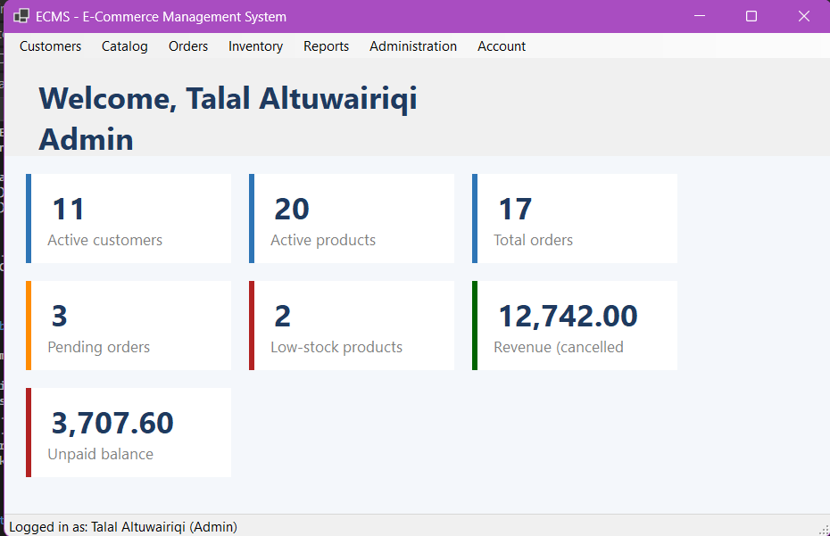

</div>

<br>

| | |
|---|---|
| **23** Windows Forms screens | **9** tables, **4** views, **3** stored procedures |
| **3** layers: Presentation, Business, Data Access | **2** roles: Admin and Staff |
| **5** SQL transactions protecting stock, orders and payments | **0** string-built SQL queries (all parameterized) |

---

## Overview

ECMS is used by the staff of a store to manage **customers, products, stock, orders and payments**. Staff sign in with a role, create orders for customers, move each order through its status workflow, record payments, control the inventory and, for admins, read sales reports.

The goal of the project is solid engineering rather than screens alone:

- a **normalized relational schema** where the database protects itself with constraints,
- a **strict layered design** where forms never touch SQL,
- **transactional business logic**, so orders, stock and payments can never drift apart,
- **security basics** done properly: hashed passwords, parameterized queries and role checks in the business layer.

## Screenshots

<table>
  <tr>
    <td align="center">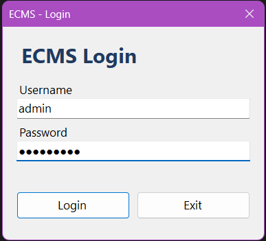<br><sub><b>Login</b></sub></td>
    <td align="center"><br><sub><b>Dashboard (Admin)</b></sub></td>
  </tr>
  <tr>
    <td align="center">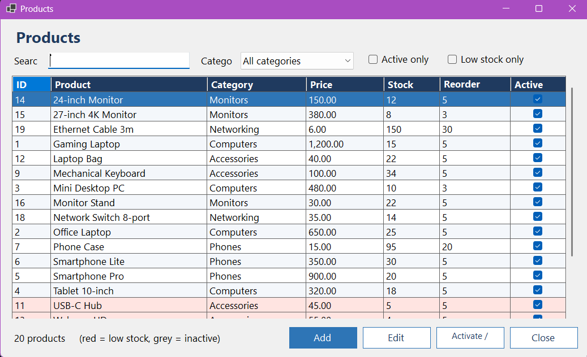<br><sub><b>Products with low-stock highlight</b></sub></td>
    <td align="center">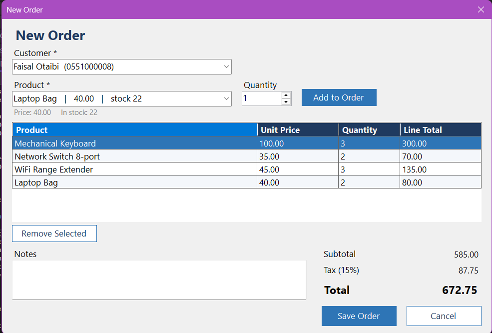<br><sub><b>New Order with live totals</b></sub></td>
  </tr>
  <tr>
    <td align="center">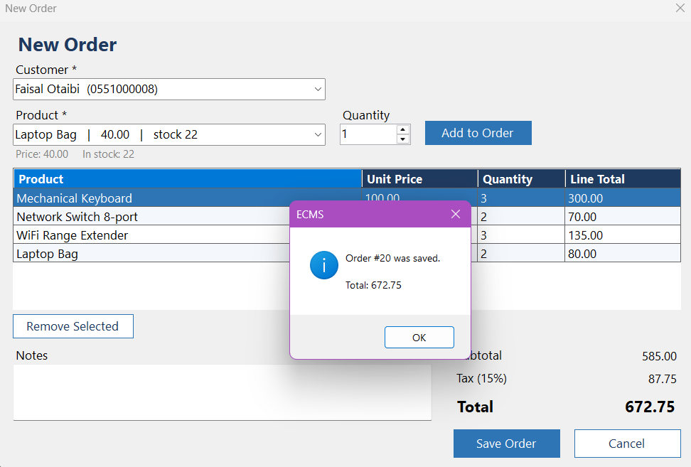<br><sub><b>Order details and status workflow</b></sub></td>
    <td align="center">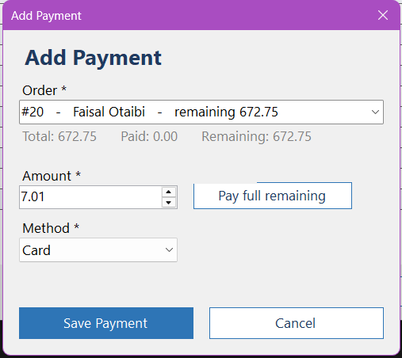<br><sub><b>Payments</b></sub></td>
  </tr>
  <tr>
    <td align="center">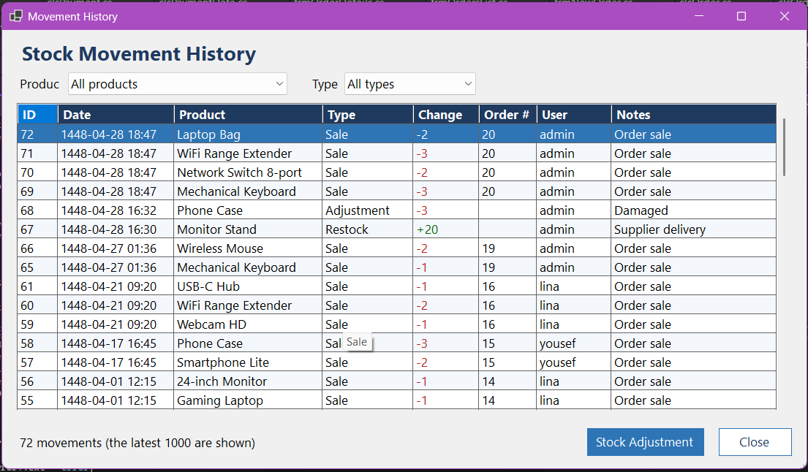<br><sub><b>Stock movement history</b></sub></td>
    <td align="center">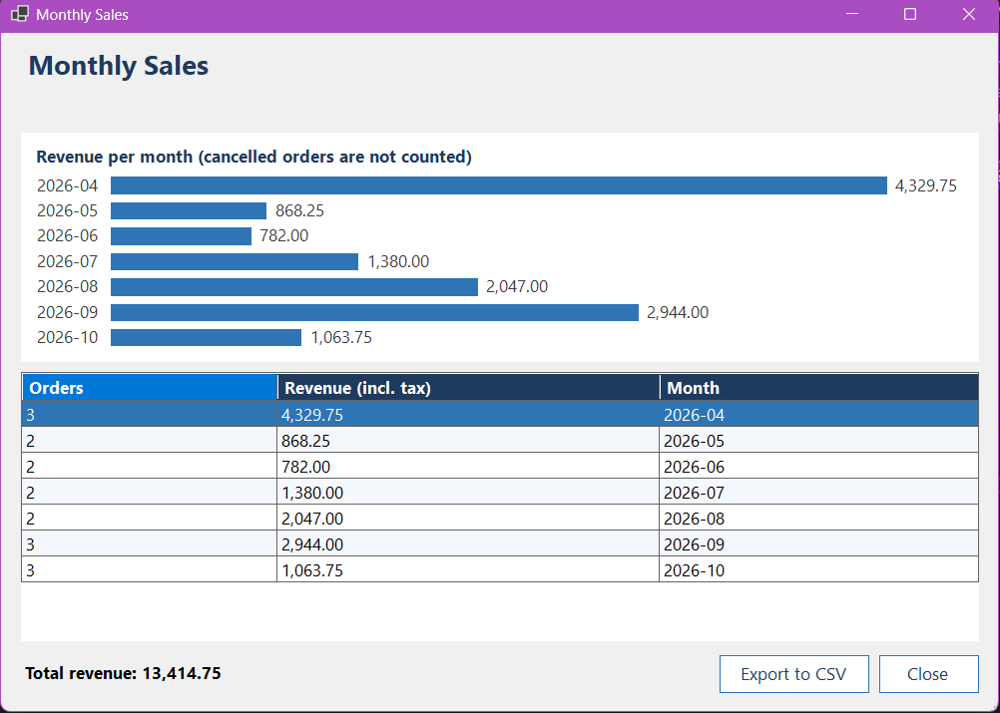<br><sub><b>Monthly sales report</b></sub></td>
  </tr>
</table>

## Features

<details open>
<summary><b>Security and users</b></summary>

- Login with **BCrypt-hashed passwords** and two roles: Admin and Staff.
- Menus and actions depend on the role, and the rules are enforced in the **Business layer**, not only by hiding buttons.
- Admin user management: add, edit, activate or deactivate, reset password.
- An admin cannot lock themselves out, and at least one active admin always remains.
- Every user can change their own password (the current password is required).
</details>

<details open>
<summary><b>Customers and catalog</b></summary>

- A shared `People` table: one person can be a customer, a staff user, or both.
- Customers: search, add, edit, activate or deactivate, and view each customer's orders.
- Categories and products with search, category filter, active-only and low-stock filters.
- Low-stock products are highlighted. Products are **deactivated, never deleted**, so order history stays intact.
</details>

<details open>
<summary><b>Orders and payments</b></summary>

- New Order screen: pick a customer, add products, and watch subtotal, tax and total update live.
- Status workflow: **Pending, Processing, Shipped, Delivered**. Orders can be **cancelled** before they ship, and the stock is returned automatically.
- Payments by cash, card or transfer, with **partial payments**. A payment can never exceed the remaining balance.
</details>

<details open>
<summary><b>Inventory</b></summary>

- Restock and stock corrections, each with a mandatory reason.
- A complete **stock movement history**: sales, cancellations, restocks and corrections.
- A low-stock screen with a one-click restock.
</details>

<details open>
<summary><b>Reports and dashboard (Admin)</b></summary>

- Dashboard cards: customers, products, orders, pending orders, low stock, revenue and unpaid balance.
- Best sellers, monthly sales and sales by category (with a date range), each with a bar chart and **Export to CSV**.
- Reports read the SQL views and the stored procedure directly.
</details>

## Architecture

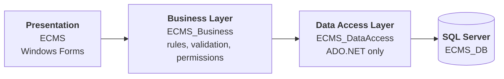

| Layer | Responsibility |
|---|---|
| **ECMS** (Presentation) | 23 forms. Shows data and collects input. Contains no SQL and no business rules. |
| **ECMS_Business** | Validation, calculations, status workflow, permissions, password hashing. |
| **ECMS_DataAccess** | ADO.NET only: parameterized commands, stored procedure calls and transactions. |

The forms never reference the Data Access project, so the compiler itself prevents shortcuts around the business rules.

<details>
<summary><b>Project structure</b></summary>

```
ECMS/
├── Database/                SQL scripts: schema, seed data, views, procedures, checks
├── ECMS/                    Presentation layer
│   ├── Global Classes/      UI helper, bar-chart control, CSV export, current user
│   ├── People/   Customers/   Users/   Categories/   Products/
│   ├── Orders/   Inventory/   Reports/
│   ├── frmLogin.cs   frmMain.cs   Program.cs   App.config
├── ECMS_Business/           Business logic layer
├── ECMS_DataAccess/         Data access layer
├── docs/                    ERD
├── screenshots/
└── ECMS.sln
```
</details>

## How an order is saved

Creating an order touches four tables. It all happens inside **one transaction**, so either everything is saved or nothing is.

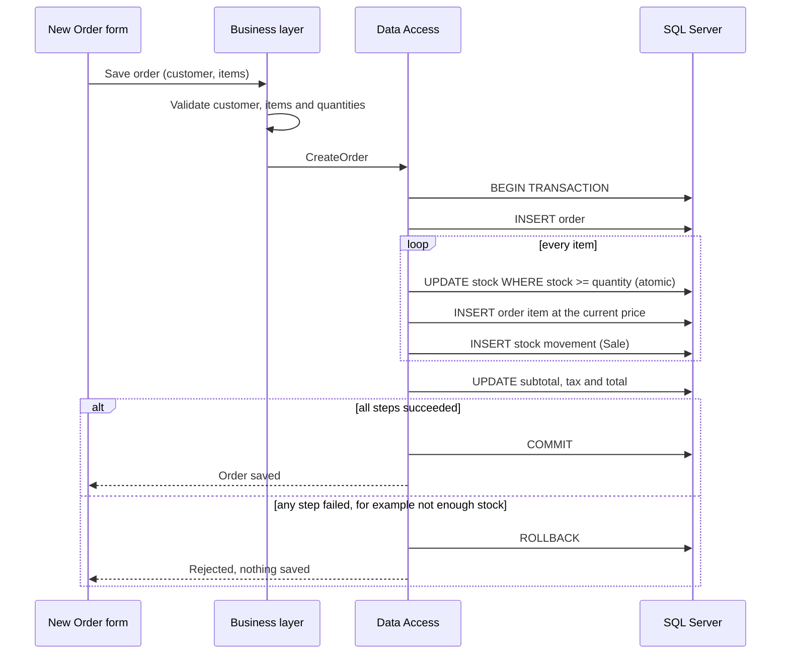

### Order status workflow

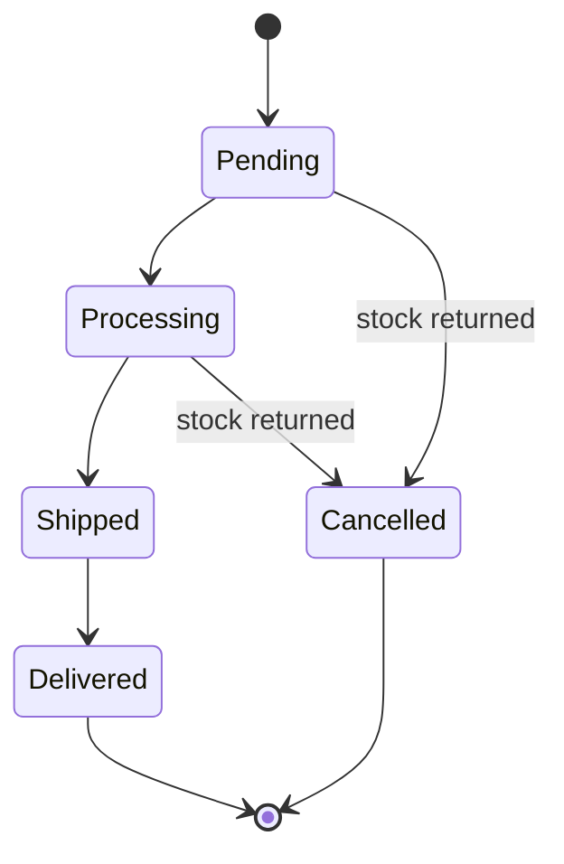

## Database

SQL Server database **ECMS_DB**: **9 tables**, **4 views**, **3 stored procedures**, indexes and constraints (primary and foreign keys, UNIQUE, CHECK and DEFAULT).

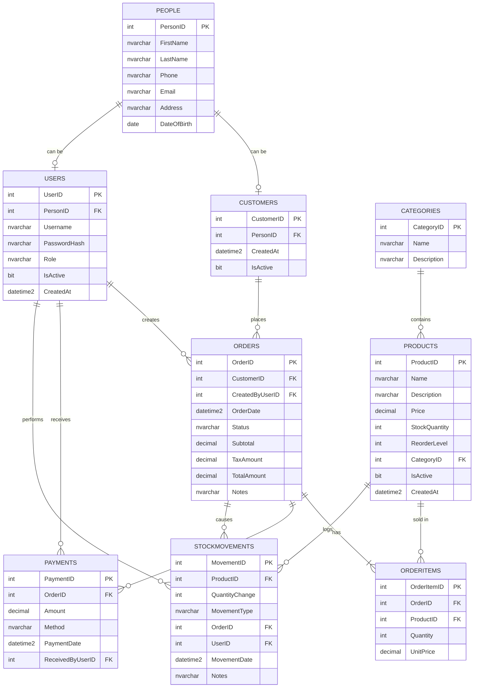

| Script | Content |
|---|---|
| `01_schema.sql` | Creates the database, the 9 tables, constraints and indexes. **Drops and re-creates `ECMS_DB`.** |
| `02_seed.sql` | Sample data: staff, 10 customers, 5 categories, 20 products, 16 orders, payments and stock history. |
| `03_views.sql` | `vw_OrderSummary`, `vw_BestSellingProducts`, `vw_LowStock`, `vw_MonthlySales` |
| `04_procedures.sql` | `sp_SalesByCategory`, `sp_GetCustomerOrders`, `sp_GetOrderItems` |
| `05_test_queries.sql` | Row counts, consistency checks, constraint tests and practice queries (joins, GROUP BY, HAVING). |

## Engineering highlights

| Topic | What the project does |
|---|---|
| **Transactions** | Creating an order, cancelling it, adding a payment, adjusting stock and adding a product with starting stock each run in a single transaction. |
| **No overselling** | Stock is taken with one atomic statement that only succeeds if enough remains, so two users cannot sell the last unit twice. |
| **Price integrity** | The price is read from the database at save time and copied into `OrderItems.UnitPrice`, so later price changes never alter old orders. |
| **Concurrent payments** | The order row is locked (`UPDLOCK`) while the balance is checked, so an order cannot be overpaid by two payments at once. |
| **Stock as a ledger** | Every change is a row in `StockMovements`, and the current stock can always be reconciled from the history. |
| **Defence in depth** | Rules are enforced in the UI, in the Business layer and again by database constraints. |
| **Security** | BCrypt hashes, parameterized queries everywhere, role checks in the Business layer. |
| **Soft delete** | Products, customers and users are deactivated instead of deleted, so history is never broken. |

```sql
-- The atomic stock reservation used when an order is saved
UPDATE dbo.Products
SET StockQuantity = StockQuantity - @Quantity
OUTPUT inserted.Price
WHERE ProductID = @ProductID AND IsActive = 1 AND StockQuantity >= @Quantity;
```

## Business rules

| Area | Rule |
|---|---|
| Order total | Subtotal = sum of unit price x quantity. Tax = subtotal x tax rate. Total = subtotal + tax. |
| Order status | Pending, Processing, Shipped, Delivered, in that order. No skipping steps. |
| Cancelling | Only while Pending or Processing. Stock is returned and logged. Not allowed when the order has payments (refunds are not supported). |
| Payments | Amount above zero and not more than the remaining balance. Not allowed on cancelled orders. |
| Stock | Can never be negative. Manual changes need a reason and are logged. |
| Users | Username 3-50 characters. Password at least 8 characters with a letter and a digit. At least one active admin must remain. |
| Deleting | People and categories can be deleted only by an admin and only if nothing refers to them. Products are deactivated, not deleted. |

## Roles and permissions

| Feature | Admin | Staff |
|---|:---:|:---:|
| Customers, people, products, categories (add and edit) | Yes | Yes |
| Delete a person or a category | Yes | No |
| Create orders, change status, cancel, take payments | Yes | Yes |
| Stock adjustment and history | Yes | Yes |
| Manage users and reset passwords | Yes | No |
| Reports, revenue and unpaid balance on the dashboard | Yes | No |

## Getting started

**Requirements:** Windows, Visual Studio 2022 with the ".NET desktop development" workload, SQL Server (Express or Developer) and SQL Server Management Studio.

**1. Clone the repository**

```bash
git clone https://github.com/TalalAltuwairiqi/ECMS.git
```

**2. Create the database.** In SSMS, run the scripts in the `Database` folder in this order: `01_schema.sql`, `02_seed.sql`, `03_views.sql`, `04_procedures.sql`.

**3. Set your server name.** In `ECMS/App.config`, change `Server=.` to your SQL Server name, for example `Server=.\SQLEXPRESS` or `Server=localhost`.

```xml
<add name="ECMS_DB"
     connectionString="Server=.;Database=ECMS_DB;Integrated Security=True;TrustServerCertificate=True;"
     providerName="Microsoft.Data.SqlClient" />
```

**4. Run.** Open `ECMS.sln` in Visual Studio, set **ECMS** as the startup project and press **F5**.

**Demo accounts** (local sample data only):

| Username | Password | Role |
|---|---|---|
| `admin` | `Admin@123` | Admin |
| `lina` | `Staff@123` | Staff |
| `yousef` | `Staff@123` | Staff |

The tax rate is configurable in `App.config`: `<add key="TaxRate" value="0.15" />`.

## Data integrity check

After using the application, this query should return **no rows**. It proves that every product's stock equals the sum of its stock movements.

```sql
SELECT p.ProductID, p.Name, p.StockQuantity, m.TotalChange
FROM dbo.Products p
JOIN (SELECT ProductID, SUM(QuantityChange) AS TotalChange
      FROM dbo.StockMovements GROUP BY ProductID) m ON m.ProductID = p.ProductID
WHERE p.StockQuantity <> m.TotalChange;
```

## Skills demonstrated

- **SQL Server:** relational design and normalization, constraints, indexes, joins, aggregates, views, stored procedures, transactions and locking hints.
- **C# and OOP:** layered architecture, separation of concerns, validation, role-based access control.
- **ADO.NET:** parameterized commands, `SqlTransaction`, stored procedure calls.
- **Windows Forms:** 23 screens, a custom-drawn chart control, CSV export.
- **Software engineering:** data integrity under concurrency, secure password handling, Git workflow.

## Limitations and roadmap

**Current limitations**

- Refunds are not supported, so an order with payments cannot be cancelled.
- Windows only, because of Windows Forms.
- No automated unit tests yet.

**Planned**

- [ ] Unit tests for the Business layer
- [ ] Suppliers and purchase orders
- [ ] Discounts and coupons
- [ ] Printable invoices (PDF)
- [ ] A modern restyled interface
- [ ] A web API and web front end on the same database

## Developed By

<div align="center">

# Talal Altuwairiqi

<a href="https://www.linkedin.com/in/talal-altuwairiqi/"></a>
<a href="https://x.com/DEV_Talal"></a>
<a href="https://github.com/TalalAltuwairiqi"></a>

</div>

<sub>This is a learning and portfolio project. All sample data is fictional.</sub>
